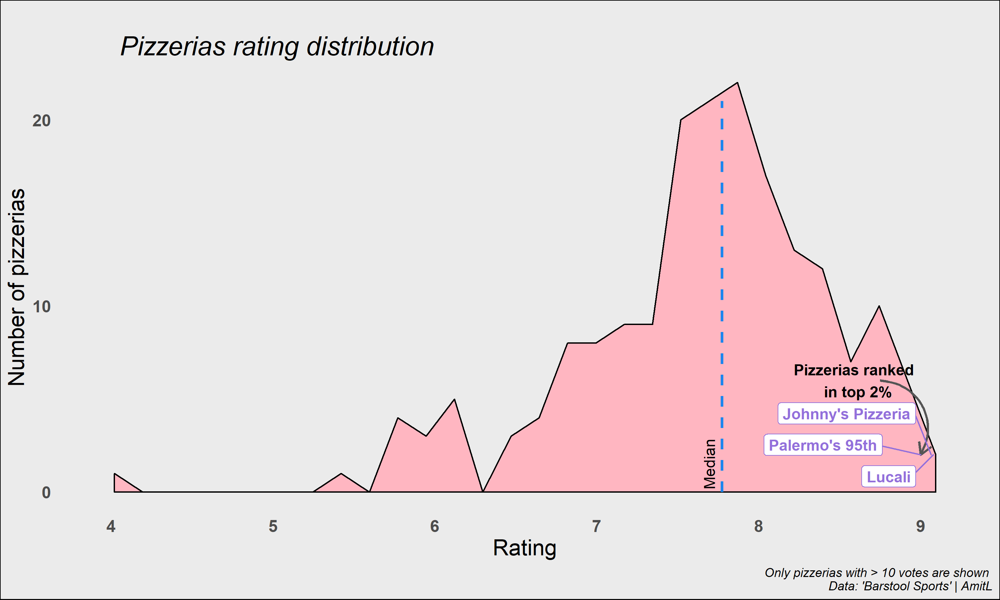

## Power lifting

In this [#TidyTuesday](https://github.com/rfordatascience/tidytuesday/tree/master/data/2019/2019-10-08) I plotted the max weight lifted throughout the years, and how do those max achievements distribute across participants.  

#### *New things I learned:*

* `ggthemr` - I played around with the different theme templats in the package. it's a very nice go to and worth a try.
* `dplyr::gather` - I never used this function and wanted to learn and give it a try. it helped gather the different activies to then split the distribution by.
* `geom_curve` - I liked using it to point to a specific place. while it might be redundant here, I wanted to give it a try and use instead of another segment running down the distribution.
4. `geom_label_repel` - I tihnk this can work better with a scatter plot and might be kind of messy here, but i learned how to show labels only for *specific* values which was cool to learn.

