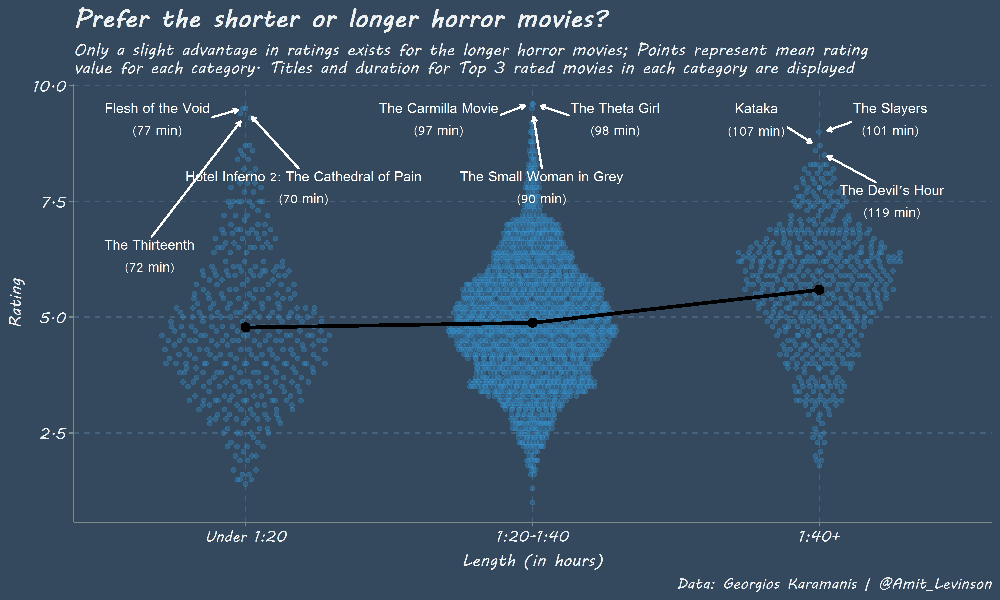
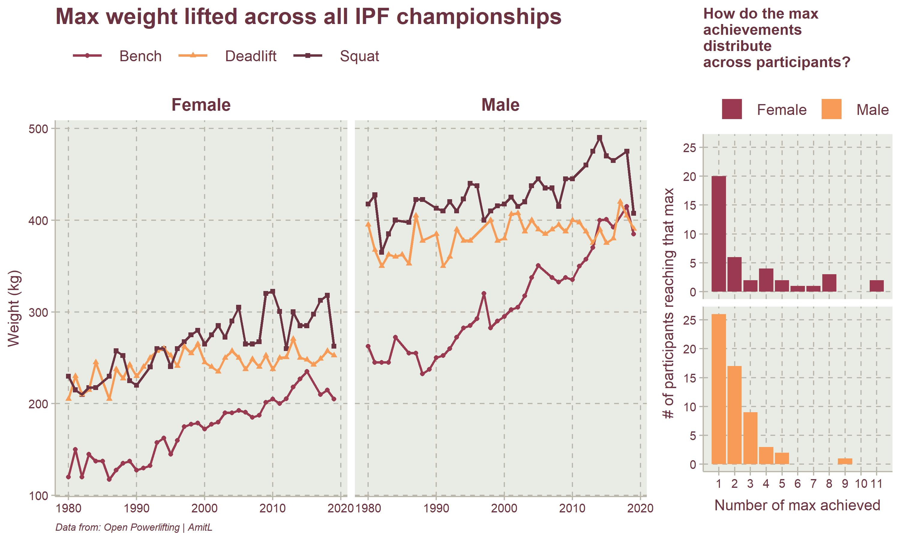
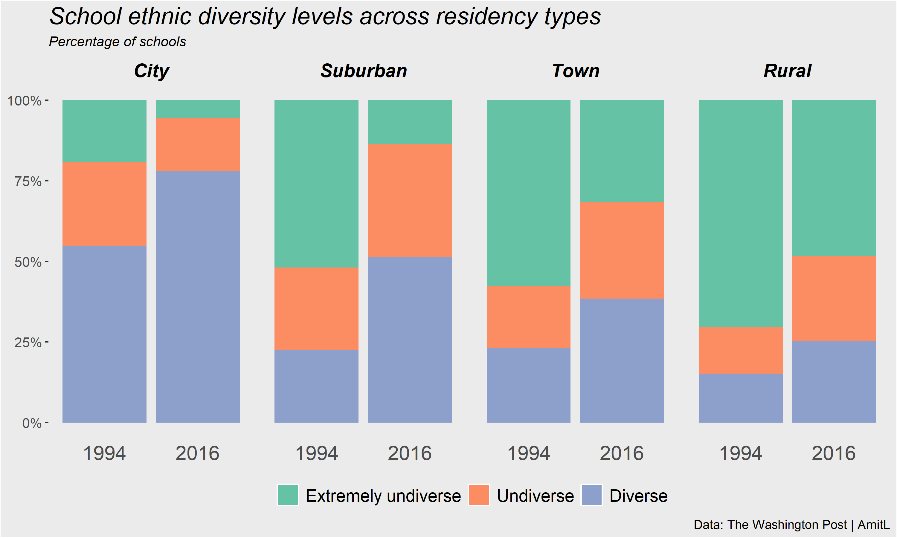

### **What is TidyTuesday?**

TidyTuesday is *"A weekly data project aimed at the R ecosystem. [...] an emphasis was placed on understanding how to summarize and arrange data to make meaningful charts with ggplot2, tidyr, dplyr, and other tools in the tidyverse ecosystem."* according to the project's page on [GitHub](https://github.com/rfordatascience/tidytuesday). 

Basically, every week they publish a new data set where the R community is welcome to analyze and visualize data (Actually, in general, I think any programming language is welcome according to their guidelines). 
I started learning R and saw it as a great opportunity to practice plotting and analzying datasets. If you're looking to get some practice or enjoy analyzing the same data sets as others - Join the party, there's much to learn!  
 

Below are graphs I made, organized in a descending order:
 

### **31.10.2019**

[Link to code](https://github.com/AmitLevinson/TidyTuesday/blob/master/Week44_NYC_Squerrils/Squirrels.Rmd)

### **22.10.2019**  

[Link to code](https://github.com/AmitLevinson/TidyTuesday/blob/master/Week43_Horror_Films/Horror_dis.R)

 

### **9.10.2019**  

[Link to code](https://github.com/AmitLevinson/TidyTuesday/blob/master/Week41_Power_lifting/ipf.R)

 

### **6.10.2019**  

[Link to code](https://github.com/AmitLevinson/TidyTuesday/blob/master/Week40_All%20the%20Pizza/Barstool_Top_2_Percent.R)

 

### **28.9.2019**  

[Link to code](https://github.com/AmitLevinson/TidyTuesday/blob/master/2_Week39_SchoolDiversity/School_Diversity_Updated.R)

 

### **22.9.2019**  

[Link to code](https://github.com/AmitLevinson/TidyTuesday/blob/master/1_Week38_Number%20of%20Visitors/National%20Parks.R)

