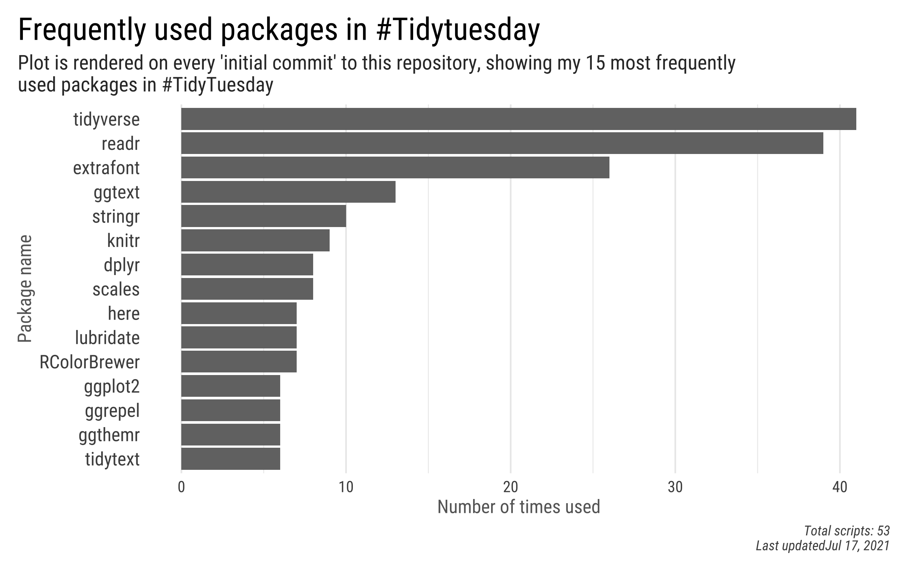
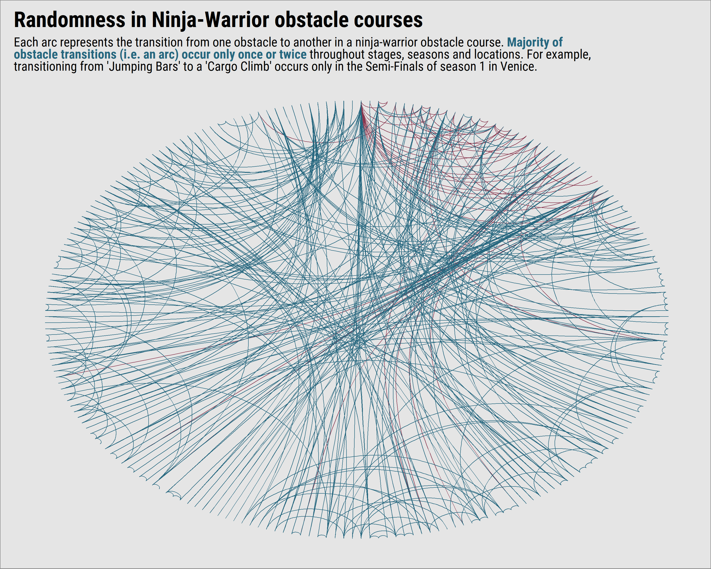
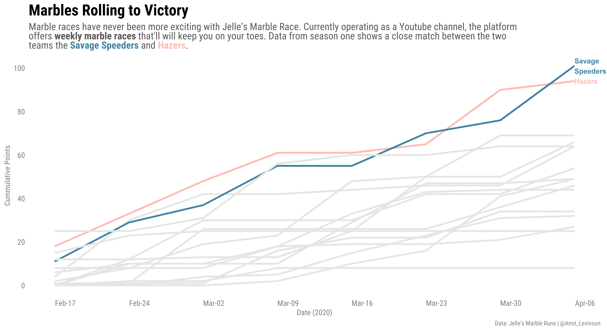
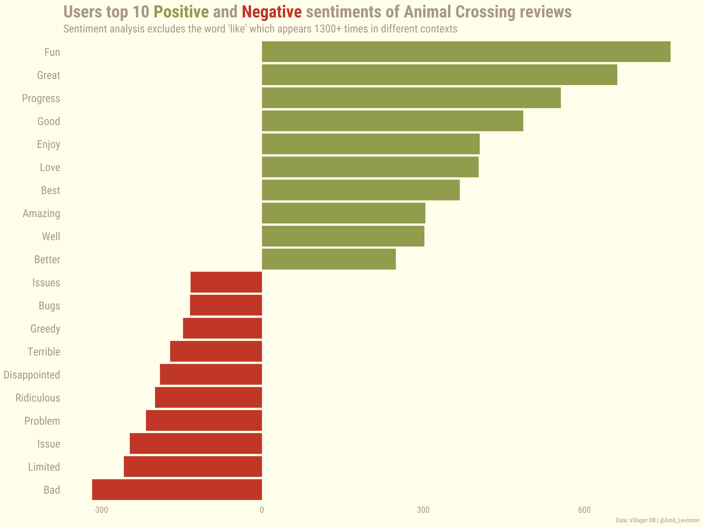
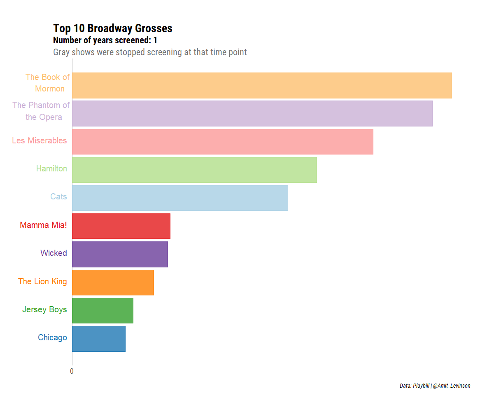
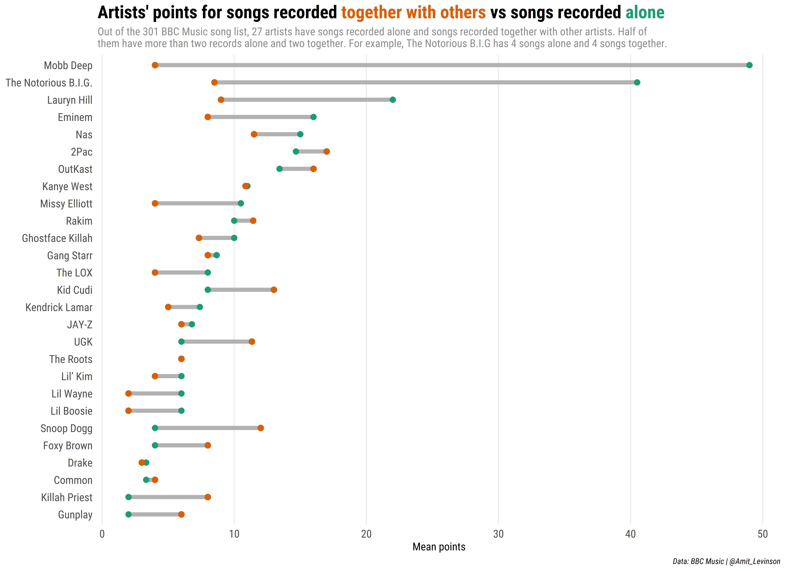
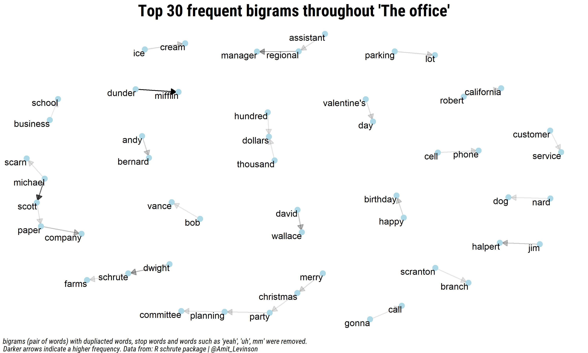
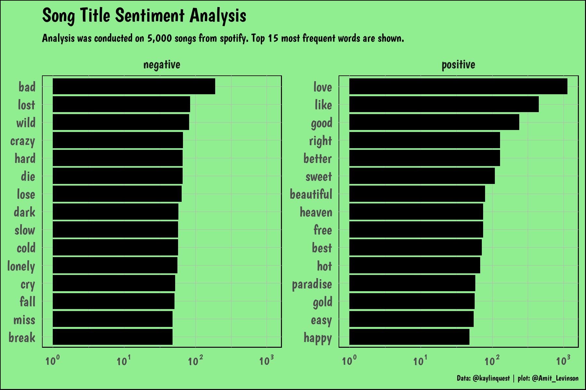

### **What is TidyTuesday?**

TidyTuesday is *"A weekly data project aimed at the R ecosystem. [...] an emphasis was placed on understanding how to summarize and arrange data to make meaningful charts with ggplot2, tidyr, dplyr, and other tools in the tidyverse ecosystem."* according to the project's page on [GitHub](https://github.com/rfordatascience/tidytuesday). 

Basically, every week they publish a new data set where the R community is welcome to analyze and visualize data (Actually, in general, I think any programming language is welcome according to their guidelines). 
I started learning R and saw it as a great opportunity to practice plotting and analzying datasets. If you're looking to get some practice or enjoy analyzing the same data sets as others - Join the party, there's much to learn. 
 

Below are graphs I made, organized in a descending order:
 

### **19.12.2020**  
[Link to code](https://github.com/AmitLevinson/TidyTuesday/blob/master/2020/week_41/week41_ncaa.R)

### **6.10.2020**  
[Link to code](https://github.com/AmitLevinson/TidyTuesday/blob/master/2020/week_41/week41_ncaa.R)

### **29.09.2020**  
Beyonce's lyrics | [Link to code](https://github.com/AmitLevinson/TidyTuesday/blob/master/2020/week_40_b_t/week40_beyonce-swift.R)

### **23.07.2020**
[Link to code](https://github.com/AmitLevinson/TidyTuesday/blob/master/2020/week30-aus_animals/aus-animals.R)

### **22.06.2020**
[Link to code](https://github.com/AmitLevinson/TidyTuesday/blob/master/2020/week25-slavery/shiny-app/app.R)

### **3.06.2020**
[Link to code](https://github.com/AmitLevinson/TidyTuesday/blob/master/2020/week23_marble-races/marble-races.Rmd)

### **14.05.2020**
[Link to code](https://github.com/AmitLevinson/TidyTuesday/blob/master/2020/week20_volcano/week20_volcano.R)

### **06.05.2020**
[Link to code](https://github.com/AmitLevinson/TidyTuesday/blob/master/2020/week19_ac/week10-ac.Rmd)

### **29.04.2020**
[Link to code](https://github.com/AmitLevinson/TidyTuesday/blob/master/2020/week18_broadway/broadway.R)

### **16.04.2020**
[Link to code](https://github.com/AmitLevinson/TidyTuesday/blob/master/2020/week16_rapartists/rapartists.R)

### **17.03.2020**

[Link to code](https://github.com/AmitLevinson/TidyTuesday/blob/master/2020/week12_theoffice/the_office.R)

### **06.03.2020** 

[Link to code](https://github.com/AmitLevinson/TidyTuesday/blob/master/2020/week10_nhl/nhl.Rmd) | [Link to app](https://amit-levinson.shinyapps.io/tidytuesday_week_10_nhl/)

### **20.01.2020**  

[Link to code](https://github.com/AmitLevinson/TidyTuesday/blob/master/2020/week4_spotify_songs/spotify_songs.R)

### **11.12.2019**  
[Link to code](https://github.com/AmitLevinson/TidyTuesday/blob/master/2019/Week50_diseases/diseases.R)

  

### **5.12.2019**  
[Link to code](https://github.com/AmitLevinson/TidyTuesday/blob/master/2019/Week49_parking_tickets/parking_tickets.R)

### **6.11.2019**

[Link to code](https://github.com/AmitLevinson/TidyTuesday/blob/master/2019/Week45_bike_walk/bike_walk.Rmd)

  

### **31.10.2019**  

[Link to code](https://github.com/AmitLevinson/TidyTuesday/blob/master/Week44_NYC_Squerrils/Squirrels.Rmd)

### **22.10.2019**  

[Link to code](https://github.com/AmitLevinson/TidyTuesday/blob/master/2019/Week43_Horror_Films/Horror_dis.R)

 

### **9.10.2019**  

[Link to code](https://github.com/AmitLevinson/TidyTuesday/blob/master/2019/Week41_Power_lifting/ipf.R)

 

### **6.10.2019**  

[Link to code](https://github.com/AmitLevinson/TidyTuesday/blob/master/2019/Week40_All%20the%20Pizza/Barstool_Top_2_Percent.R)

 

### **28.9.2019**  

[Link to code](https://github.com/AmitLevinson/TidyTuesday/blob/master/2019/2_Week39_SchoolDiversity/School_Diversity_Updated.R)

 

### **22.9.2019**  

[Link to code](https://github.com/AmitLevinson/TidyTuesday/blob/master/2019/1_Week38_Number%20of%20Visitors/National%20Parks.R)

