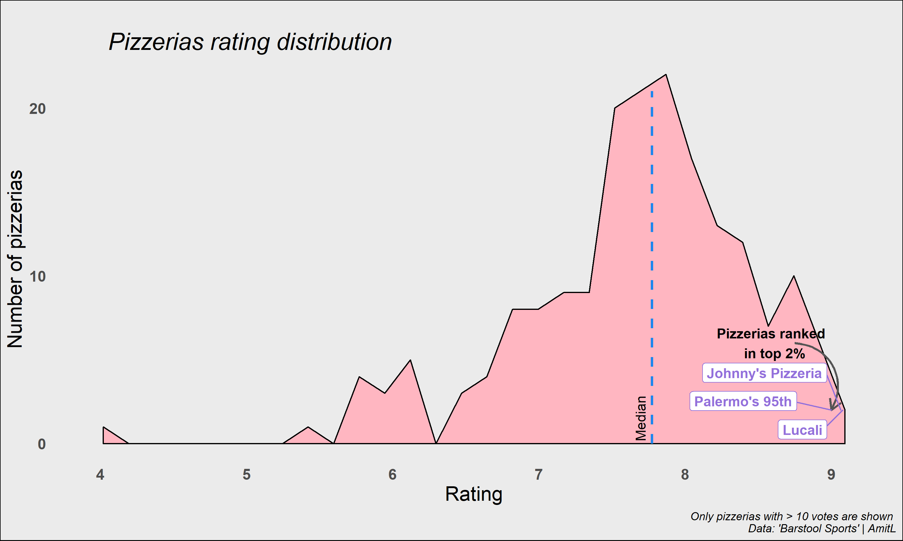

## All The Pizza

In this [#TidyTuesday](https://github.com/rfordatascience/tidytuesday) I plotted the distribution of pizzeria ratings by 'Barstool Sports'.

#### New things I learned:

1. `rename` function - an easy way to change names of variables.
2. `geom_area` - i never plotted using this plot so it was nice getting a try at it.
3. `geom_curve` - I liked using it to point to a specific place. while it might be redundant here, I wanted to give it a try and use instead of another segment running down the distribution.
4. `geom_label_repel` - I tihnk this can work better with a scatter plot and might be kind of messy here, but i learned how to show labels only for *specific* values which was cool to learn.

